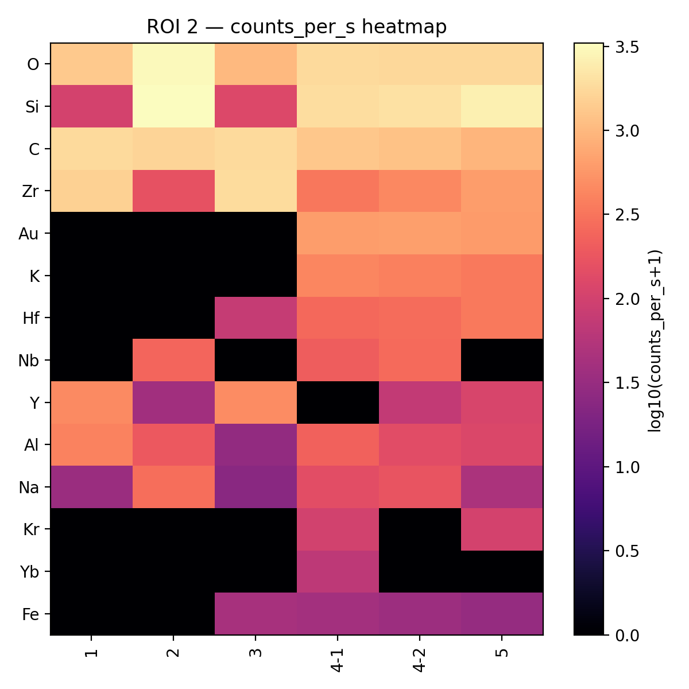

# Evaluation of Bonding Effect of Different Surface Treatments on Yttria-Tetragonal Zirconia Polycrystal (Y-TZP)

## Abstract

This study aims to evaluate the bonding effect of different surface treatments on yttria-tetragonal zirconia polycrystal (Y-TZP) to resin cements. A total of 80 Y-TZP zirconia blocks were prepared and divided into 4 groups with lithium disilicate serving as a control group (n=20). Surface characterization included surface energy and wettability measurements using the Owens–Wendt–Rabel–Kaelble (OWRK) method. Shear bond strength (SBS) was tested after 24 hours of water storage at 37°C, and failure modes were examined microscopically. Surface morphology and composition were analyzed using scanning electron microscopy (SEM) and energy-dispersive X-ray spectroscopy (EDS).

## Introduction

Yttria-tetragonal zirconia polycrystal (Y-TZP) has become a popular material for dental restorations due to its superior mechanical properties and aesthetic qualities. However, the chemical inertness and lack of silica content in Y-TZP presents challenges for achieving durable resin bonding, which is critical for long-term clinical success. Various surface pretreatment methods have been developed to enhance the bond strength between zirconia and resin cements, including grit-blasting with alumina particles and 10-MDP primer, zirconia-slurry coating systems, and lithium-disilicate-particle coating with hydrofluoric acid treatment. While these methods show promise in improving surface wettability and mechanical interlocking, their comparative effectiveness remains unclear. **The null hypothesis of this study is that there is no significant difference in shear bond strength between Y-TZP surfaces treated with different surface pretreatment protocols (grit-blasting with 10-MDP, zirconia-slurry coating with 10-MDP, lithium-disilicate-particle coating with HF and silane, and lithium-disilicate-particle coating with HF, silane, and 10-MDP).** This investigation evaluates four experimental groups with a lithium disilicate control to determine which surface modification technique provides optimal bonding performance for clinical applications.

## 1. Test Materials (Surface Pre-treatment)

### 1.1 Lithium-Disilicate-Particle Coating (Biomic Lisi Connect)


**Fig.1.** Biomic Lisi Connect lithium-disilicate-particle coating process on Y-TZP zirconia surface.

- Biomic Lisi Connect is applied to the Y-TZP bonding surface, and lithium disilicate crystallization occurs during a single sintering cycle, forming a thin surface coating
- The resulting surface modification provides a glass-ceramic–like bonding effect, improving the adhesive performance of zirconia
- This coating enables conventional silane coupling chemistry similar to lithium disilicate ceramics

**Source:** Aidite (Biomic)

### 1.2 Zirconia-Slurry Coating (Ziradd)


**Fig.2.** Ziradd zirconia-slurry coating process with carbon nanoparticles on pre-sintered Y-TZP.

- Sintering is performed after applying a zirconia-slurry (Ziradd) containing carbon nanoparticles to the surface of pre-sintered Y-TZP
- Nano-sized ZrO₂ particles attach to the zirconia surface via hydrogen bonding under basic conditions, and carbon nanoparticles result in the formation of reticulated porous zirconia after sintering
- This creates micromechanical roughening to enhance mechanical interlocking with resin cements

**Source:** PNU ADD

## 2. Study Design

### 2.1 Experimental Groups

| Group | Substrate | Surface Treatment | Primer/Adhesive | n |
|-------|-----------|-------------------|-----------------|---|
| **Zr-AOP/M** | Y-TZP Zirconia | Grit-blasted with 50µm alumina | 10-MDP | 20 |
| **LD-HF/S** (Control) | Lithium Disilicate | HF (9.5%) | Silane | 20 |
| **Zr-ZP/M** | Y-TZP Zirconia | Zirconia-slurry (Ziradd) coating | 10-MDP | 20 |
| **Zr-LiP-HF/S** | Y-TZP Zirconia (LiSi coating) | Lithium-disilicate-particle + HF (9.5%) | Silane | 20 |
| **Zr-LiP-HF/SM** | Y-TZP Zirconia (LiSi coating) | Lithium-disilicate-particle + HF (9.5%) | Silane + 10-MDP | 20 |

**Group nomenclature:**
- **Zr** = Y-TZP Zirconia
- **LD** = Lithium Disilicate
- **AOP** = Alumina particle (Airborne-particle abrasion)
- **ZP** = Zirconia-slurry particle (Ziradd)
- **LiP** = Lithium-disilicate-particle (Biomic Lisi Connect)
- **HF** = Hydrofluoric acid etching
- **M** = 10-MDP primer
- **S** = Silane coupling agent

### 2.2 Experimental Protocol

```
Surface Treatment
        ↓
Surface Roughness Measurement
        ↓
Contact Angle Measurement
        ↓
Surface Energy Calculation
        ↓
Storage in water (37℃, 24 hr)
(n=15, each group)
        ↓
Shear Bond Strength Test
        ↓
Failure Mode Analysis
        ↓
SEM Observation
```

## 3. Materials and Methods

### 3.1 Specimen Preparation and Surface Treatments


**Fig.3.** Flowchart of the experimental protocol showing sequential specimen preparation, surface treatment, and testing procedures.

A total of 80 Y-TZP zirconia blocks (10mm × 14mm) and 20 lithium disilicate blocks were prepared through sequential milling, sintering, and surface treatment processes according to manufacturer's recommendations. Four experimental groups were evaluated: **Zr-AOP/M** (Y-TZP grit-blasted with 50µm alumina particles followed by 10-MDP primer application), **LD-HF/S** (lithium disilicate control with 9.5% hydrofluoric acid etching and silane coupling agent), **Zr-ZP/M** (Y-TZP with Ziradd zirconia-slurry coating containing carbon nanoparticles followed by 10-MDP primer), **Zr-LiP-HF/S** (Y-TZP with Biomic Lisi Connect lithium-disilicate-particle coating, 9.5% HF etching, and silane application), and **Zr-LiP-HF/SM** (Y-TZP with Biomic Lisi Connect lithium-disilicate-particle coating, 9.5% HF etching, and dual primer system combining silane and 10-MDP). The lithium-disilicate-particle coating utilized crystallization during a single sintering cycle to create a glass-ceramic-like bonding surface, while the zirconia-slurry group employed nano-sized ZrO₂ particles that attach via hydrogen bonding to form reticulated porous zirconia after sintering for enhanced micromechanical roughening.

### 3.2 Contact Angle and Surface Energy Measurements

For surface characterization, surface wettability was evaluated before applying primer using the sessile drop method with a contact angle goniometer (n=5 specimens per group). Two test liquids were employed to calculate surface free energy using the Owens–Wendt–Rabel–Kaelble (OWRK) method: distilled water (polar component) and diiodomethane (DIM, dispersive component). A 2µL droplet was dispensed onto each specimen surface, and contact angles were measured after a 7-second dwell time to ensure equilibration. The OWRK method allowed for assessment of surface hydrophilicity, total surface energy, and its polar and dispersive components following each surface treatment protocol. Surface free energy values were analyzed using one-way ANOVA and Tukey's post hoc test (α=0.05).

### 3.3 Shear Bond Strength Testing and Failure Analysis

Following surface treatment and primer application, resin cement rods (Dou Link) were fabricated on each specimen using an Ultradent jig with semicircular plastic molds. The cement was light-cured for 15 seconds twice, excess material was removed, and specimens received an additional 15-second cure after jig removal. All specimens were inspected for defects and stored in distilled water at 37°C for 24 hours prior to testing (n=15 per group). Shear bond strength (SBS) was evaluated using a notched-edge test configuration at a crosshead speed of 1.0 ± 0.1 mm/min until failure. SBS values were analyzed using one-way ANOVA and Tukey's post hoc test (α=0.05). Fractured surfaces were examined microscopically under light microscopy to classify failure modes as adhesive (interfacial separation between substrate and resin cement), cohesive (material fracture within substrate or cement), or mixed (combination of both). Selected specimens underwent scanning electron microscopy (SEM) with energy-dispersive X-ray spectroscopy (EDS) to characterize surface morphology and elemental composition across three zones: the bonding surface, the substrate-bonding interface, and the treated substrate surface.

## 4. Results

### 4.1 Surface Energy and Wettability

#### Contact Angle Measurements

| Group | θ_Water (°) | θ_DIM (°) | Surface Energy |
|-------|-------------|-----------|----------------|
| **Zr-AOP/M** | 73.72 ± 9.03 | 4.73 ± 0.83 | Low |
| **LD-HF/S** | 47.10 ± 14.01 | 21.50 ± 6.91 | High |
| **Zr-ZP/M** | 45.84 ± 4.21 | 28.77 ± 1.69 | Moderate |
| **Zr-LiP-HF/S** | 49.25 ± 3.86 | 47.89 ± 3.13 | High |


**Fig.4.** Contact angle measurements and surface energy values for different surface treatment groups using the OWRK method.

**Key findings:**
- Lithium-disilicate-particle–coated surfaces (Zr-LiP-HF/S) showed significantly higher surface energy compared with grit-blasted surfaces (Zr-AOP/M) (p<0.05)
- Surfaces treated with zirconia-slurry (Zr-ZP/M) exhibited moderate surface energy, higher than grit-blasted surfaces but lower than lithium-disilicate-particle coating (p<0.05)
- Lower water contact angles indicate more hydrophilic surfaces with better wettability characteristics
- Surface free energy calculated using OWRK method showed statistical differences among groups (one-way ANOVA, p<0.05)

### 4.2 Shear Bond Strength (SBS)


**Fig.5.** Comparative shear bond strength (SBS) values in MPa for all experimental groups with statistical significance indicators.

*Graph showing comparative bond strength values (MPa) for all five groups with error bars*

**Shear bond strength results:**

| Group | Relative SBS | Statistical Significance |
|-------|--------------|-------------------------|
| **Zr-AOP/M** | Moderate | - |
| **LD-HF/S** (Control) | Reference | - |
| **Zr-ZP/M** | **Lowest** | p<0.05 (compared to all groups) |
| **Zr-LiP-HF/S** | High | p<0.05 |
| **Zr-LiP-HF/SM** | **Highest** | p<0.05 (compared to all groups) |

**Key findings:**
- The zirconia-slurry group (Zr-ZP/M) showed the lowest shear bond strength among all groups (p<0.05), suggesting that micromechanical roughening alone was insufficient to achieve stable resin bonding
- Zr-LiP-HF/SM exhibited the highest shear bond strength, indicating synergistic effects of silane and MDP coupling on the coated surface (p<0.05)
- Statistical analysis performed using one-way ANOVA and Tukey's post hoc test (α=0.05)

#### Failure Mode Analysis


**Fig.6.** Distribution of failure modes (adhesive, cohesive, mixed) across different surface treatment groups.

**Failure mode categories:**

| Group | Adhesive Failure | Cohesive Failure | Mixed Failure |
|-------|------------------|------------------|---------------|
| **Zr-AOP/M** | ■ ■ ■ | ■ ■ ■ ■ | ■ ■ ■ ■ ■ |
| **LD-HF/S** | ■ ■ | ■ ■ ■ ■ ■ | ■ ■ ■ |
| **Zr-ZP/M** | ■ ■ ■ ■ | ■ ■ ■ | ■ ■ ■ ■ |
| **Zr-LiP-HF/S** | ■ ■ | ■ ■ ■ ■ ■ ■ | ■ ■ ■ |
| **Zr-LiP-HF/SM** | ■ | ■ ■ ■ ■ ■ ■ ■ | ■ ■ ■ |

*Note: Each ■ represents approximate proportion of failure types. Actual chart/graph from original PDF not available.*

**Failure pattern observations:**
- **Adhesive failure:** Bond breaks at interface between substrate and resin cement
- **Cohesive failure:** Fracture occurs within the material itself (indicates stronger bonding exceeding material strength)
- **Mixed failure:** Combination of both adhesive and cohesive failure modes at the interface between substrate and resin cement
- Zr-LiP-HF/S and Zr-LiP-HF/SM showed mixed fracture patterns at the interface between the substrate and resin cement, indicating effective chemical bonding

### 4.3 Light Microscopy Observations


**Fig.7.** Light microscopy images showing fracture surfaces and failure patterns for each experimental group after SBS testing.

**Microscopic analysis of fractured surfaces for each group:**

| Group | Observation Notes |
|-------|------------------|
| **Zr-AOP/M** | *Light microscopy image showing failure pattern* |
| **LD-HF/S** | *Light microscopy image showing failure pattern* |
| **Zr-ZP/M** | *Light microscopy image showing failure pattern* |
| **Zr-LiP-HF/S** | *Light microscopy image showing failure pattern - mixed fracture at interface* |
| **Zr-LiP-HF/SM** | *Light microscopy image showing failure pattern - mixed fracture at interface* |


### 4.4 SEM/EDS Analysis


**Fig.8.** Scanning electron microscopy (SEM) images and energy-dispersive X-ray spectroscopy (EDS) analysis of bonding surfaces across three zones.

**Analysis zones:**

- **Zone 1:** Bonding surface (top layer)
- **Zone 2:** Interface of substrate and bonding surface (transition region)
- **Zone 3:** Surface after treatment (substrate surface)

**SEM/EDS examination provides:**
- Surface morphology characterization
- Interface quality assessment
- Elemental composition analysis
- Evidence of surface treatment effectiveness

### 4.5 Region of Interest (ROI) Analysis

#### 4.5.1 Bonding Surface Elemental Distribution (Zone 1)


**Fig.9.** Elemental composition heatmap of the bonding surface (Zone 1) across all experimental groups showing relative concentrations of key elements.

**Elemental distribution analysis:**

The heatmap analysis of Zone 1 (bonding surface) reveals distinct elemental signatures across the five groups:

- **Group 1 (Zr-AOP/M):** High zirconium (Zr) content with aluminum (Al) traces from grit-blasting, showing characteristic Y-TZP surface with mechanical roughening effects
- **Group 2 (LD-HF/S):** Dominant silicon (Si) and oxygen (O) signals consistent with lithium disilicate glass-ceramic composition, with minimal zirconium presence
- **Group 3 (Zr-ZP/M):** Elevated zirconium content with carbon (C) signatures from the nanoparticle-containing slurry coating, indicating successful surface modification
- **Group 4 (Zr-LiP-HF/S):** Strong silicon (Si) signal indicating lithium disilicate coating layer on zirconia substrate, with reduced zirconium signal compared to Groups 1 and 3
- **Group 5 (Zr-LiP-HF/SM):** Similar silicon-rich profile to Group 4, confirming consistent lithium-disilicate-particle coating across both LiSi-treated groups

**Key findings:** Groups 4 and 5 demonstrate successful transformation of the zirconia surface into a silica-rich bonding interface, enabling silane coupling chemistry similar to the lithium disilicate control (Group 2).

#### 4.5.2 Substrate-Bonding Interface Composition (Zone 2)



**Fig.10.** Elemental composition heatmap of the substrate-bonding interface (Zone 2) showing transition zone characteristics and gradient distributions.

**Interface zone analysis:**

The Zone 2 heatmap captures the critical transition region between the treated substrate and the bonding layer:

- **Group 1 (Zr-AOP/M):** Sharp interface with minimal elemental gradation, showing direct contact between zirconia and resin cement with aluminum particle embedment
- **Group 2 (LD-HF/S):** Gradual silicon and oxygen distribution indicating effective HF etching and surface dissolution, creating microretentive topography
- **Group 3 (Zr-ZP/M):** Zirconium-rich interface with carbon distribution, demonstrating the reticulated porous structure from sintered nanoparticle coating
- **Group 4 (Zr-LiP-HF/S):** Clear silicon gradient from coating to substrate, with intermediate oxygen levels indicating crystalline lithium disilicate phase at the interface
- **Group 5 (Zr-LiP-HF/SM):** Enhanced phosphorus (P) signal at the interface zone from 10-MDP primer, overlaying the silicon-rich lithium disilicate coating layer

**Key findings:** Group 5 demonstrates the most chemically complex interface with multiple bonding mechanisms (siloxane from silane and phosphate ester from 10-MDP), correlating with superior shear bond strength results. The dual chemistry creates a robust interfacial zone with enhanced chemical adhesion.

#### 4.5.3 Treated Substrate Surface Characterization (Zone 3)


**Fig.11.** Elemental composition heatmap of the treated substrate surface (Zone 3) showing post-treatment surface modifications and compositional changes.

**Substrate surface modifications:**

Zone 3 analysis reveals the extent of surface treatment penetration into the substrate material:

- **Group 1 (Zr-AOP/M):** Predominantly zirconia composition with aluminum contamination from grit-blasting particles embedded in surface valleys, minimal chemical modification
- **Group 2 (LD-HF/S):** Altered surface layer with calcium (Ca) and lithium (Li) depletion due to HF dissolution, leaving silicon-rich residual network structure
- **Group 3 (Zr-ZP/M):** Modified zirconia surface with integrated carbon and additional zirconium from the slurry coating, creating a nanostructured porous layer
- **Group 4 (Zr-LiP-HF/S):** Crystallized lithium disilicate layer firmly bonded to underlying zirconia substrate, with clear compositional boundary between coating and base material
- **Group 5 (Zr-LiP-HF/SM):** Similar lithium disilicate coating structure to Group 4, with additional phosphorus penetration from 10-MDP primer into surface irregularities created by HF etching

**Key findings:** The lithium-disilicate-particle coating (Groups 4 and 5) successfully creates a stable, silica-rich surface layer that fundamentally transforms the bonding characteristics of Y-TZP zirconia. Unlike mechanical treatments (Group 1) or slurry coatings (Group 3), the crystallized lithium disilicate layer provides true chemical bonding sites for silane coupling agents. Group 5's additional 10-MDP treatment creates a hybrid interface that combines both siloxane and phosphate ester bonding mechanisms, explaining its superior performance in shear bond strength testing.

---

## 5. Discussion

The contact angle measurements and surface energy analysis revealed significant differences among the treatment groups, with lithium-disilicate-particle–coated surfaces demonstrating substantially higher surface energy compared to grit-blasted surfaces (p<0.05). The OWRK method calculations indicated that Zr-LiP-HF/S and Zr-LiP-HF/SM groups exhibited enhanced wettability characteristics, which are critical for effective resin cement penetration and interfacial bonding. Notably, the zirconia-slurry treated group (Zr-ZP/M) showed moderate surface energy values, positioned between grit-blasted and lithium-disilicate-particle coated groups, suggesting that while micromechanical roughening improves surface characteristics, it may not be sufficient alone for optimal chemical adhesion.

The shear bond strength results demonstrated a clear hierarchy among treatment protocols, with Zr-LiP-HF/SM achieving the highest SBS values and Zr-ZP/M showing the lowest (p<0.05). The poor performance of the zirconia-slurry group, despite its moderate surface energy, suggests that micromechanical roughening alone was insufficient to achieve stable resin bonding without adequate chemical coupling mechanisms. This finding highlights the critical importance of chemical adhesion through primers like 10-MDP or silane coupling agents. The superior performance of Zr-LiP-HF/SM indicates synergistic effects when combining silane chemistry (enabled by the lithium disilicate coating) with 10-MDP coupling, providing both siloxane bonding and phosphate ester chemical adhesion to the underlying zirconia substrate.

The failure mode analysis provides crucial insights into bonding mechanisms, with Zr-LiP-HF/S and Zr-LiP-HF/SM predominantly showing mixed fracture patterns at the interface between the substrate and resin cement. This mixed failure mode indicates that the bond strength approached or exceeded the cohesive strength of the interfacial materials, representing optimal bonding performance. In contrast, groups with higher proportions of adhesive failures suggest inadequate interfacial bonding strength. The microscopic examination of fractured surfaces corroborated these classifications and revealed distinct differences in failure propagation patterns among the treatment groups.

The SEM/EDS analysis across the three zones (bonding surface, interface, and treated substrate) revealed important morphological and compositional characteristics that explain the performance differences. The lithium-disilicate-particle coating creates a silica-rich surface layer that enables conventional silane coupling chemistry, transforming the non-bondable zirconia into a bondable glass-ceramic-like surface. Meanwhile, the zirconia-slurry treatment produces a reticulated porous microstructure that enhances mechanical retention but lacks the chemical bonding sites necessary for durable adhesion. The dual primer approach in Zr-LiP-HF/SM leverages both the silica-rich coating for silane bonding and the 10-MDP primer for additional phosphate ester bonding, creating a more robust and chemically diverse interfacial zone.

## Summary

This study evaluated four different Y-TZP zirconia surface pretreatment protocols with a lithium disilicate control:
1. **Zr-AOP/M** - Grit-blasted with 50µm alumina particles and 10-MDP primer
2. **LD-HF/S** - Lithium disilicate control with HF etching and silane
3. **Zr-ZP/M** - Zirconia-slurry (Ziradd) coating and 10-MDP primer
4. **Zr-LiP-HF/S** - Lithium-disilicate-particle coating (Biomic Lisi Connect) with HF etching and silane
5. **Zr-LiP-HF/SM** - Lithium-disilicate-particle coating with HF etching, silane, and 10-MDP primer

Results were assessed through surface energy measurements using the OWRK method, shear bond strength evaluation with statistical analysis (one-way ANOVA, Tukey's post hoc, α=0.05), failure mode analysis, and microscopic characterization to determine optimal bonding protocols for Y-TZP zirconia dental restorations.

## Conclusion

Based on the surface energy characteristics, shear bond strength values, and failure mode distribution, the null hypothesis is rejected, as significant differences were observed among the surface treatment protocols (p<0.05). The combination of silane and 10-MDP treatment on lithium-disilicate–coated zirconia (Zr-LiP-HF/SM) exhibited the highest shear bond strength and favorable mixed failure patterns, indicating synergistic effects that further enhanced chemical adhesion beyond either primer system alone. This method offers a more durable resin–zirconia interface than conventional mechanical treatments (grit-blasting) or slurry-based approaches, which rely primarily on micromechanical interlocking without sufficient chemical coupling mechanisms for long-term clinical stability.
